# 🧭 Superstore-Reporting
This project aims to show capabilities of Alteryx software on the Kaggle data named "Superstore". The project includes creation of an analytic application, spatial analysis, creating report visualisations, exploratory data analysis, and a unique Alteryx approach to the traveling salesman problem.

The project includes:
- 🧰 Creation of an analytic application
- 🌐 Spatial analysis (Use of spatial tools)
- 📊 Report visualisations
- 🔍 Exploratory data analysis (EDA)
- 🧮 A unique Alteryx approach to the Traveling Salesman Problem

### 🗂️ Workflow graphical representation: Loading Data
- Using Alteryx Tools: 🧾 Input Data Tool, 🔠 Auto Field Tool, 🕓 DateTime Tool, 🔗 Join Tool, ➕ Union Tool, 🧮 Formula Tool, ✅ Select Tool, 📍 Create Points Tool, 📁 File Browse Tool, 🗒️ Text Box Tool, ⚙️ Action Tool, 🔘 Radio Button Tool, 📊 Summarize Tool.
**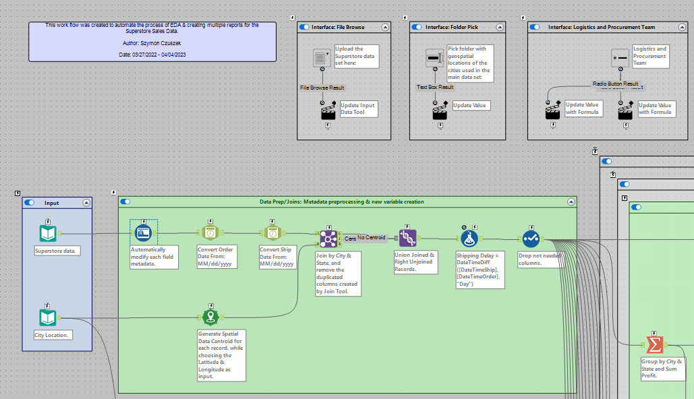**

### 🧪 Workflow graphical representation: Data manipulation.
- Using Alteryx Tools: 📊 Summarize Tool, 🧮 Formula Tool, 🎲 Sample Tool, 🔢 Sort Tool, 🔗 Join Tool, ➕ Union Tool, ⚖️ Filter Tool, and more.
**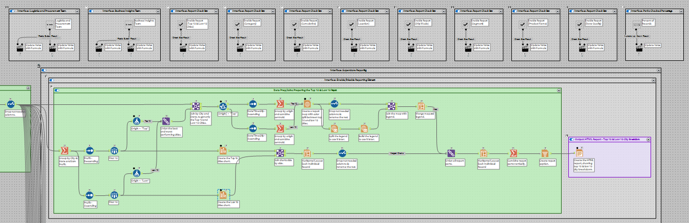**

### 📈 Workflow graphical representation: Aggregation and reporting.
- Using Alteryx Tools: ➕ Union Tool, 📉 Interactive Chart Tool, 🧩 Layout Tool, and more
**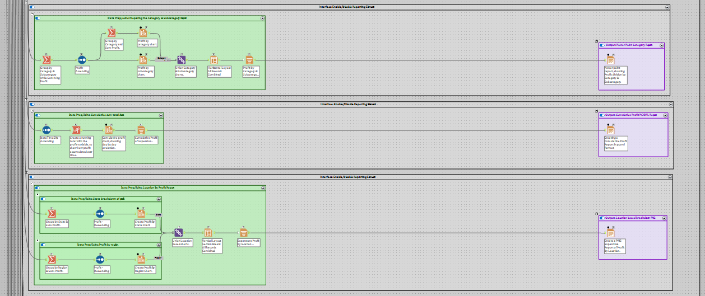**

### 📈 Workflow graphical representation: Aggregation and reporting.
- Using Alteryx Tools: ➕ Union Tool, 📉 Interactive Chart Tool, 🧩 Layout Tool, and more
**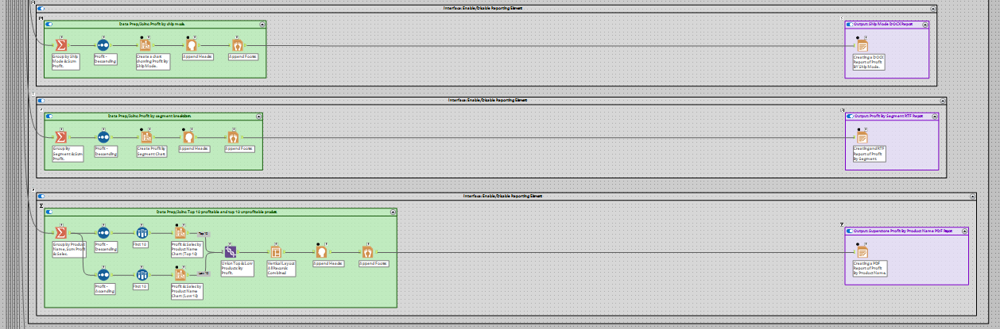**

### 🕵️ Workflow graphical representation: Data Investigation.
- Using Alteryx Tools: 📈 Spearman Correlation, 📉 Pearson Correlation, and more.
**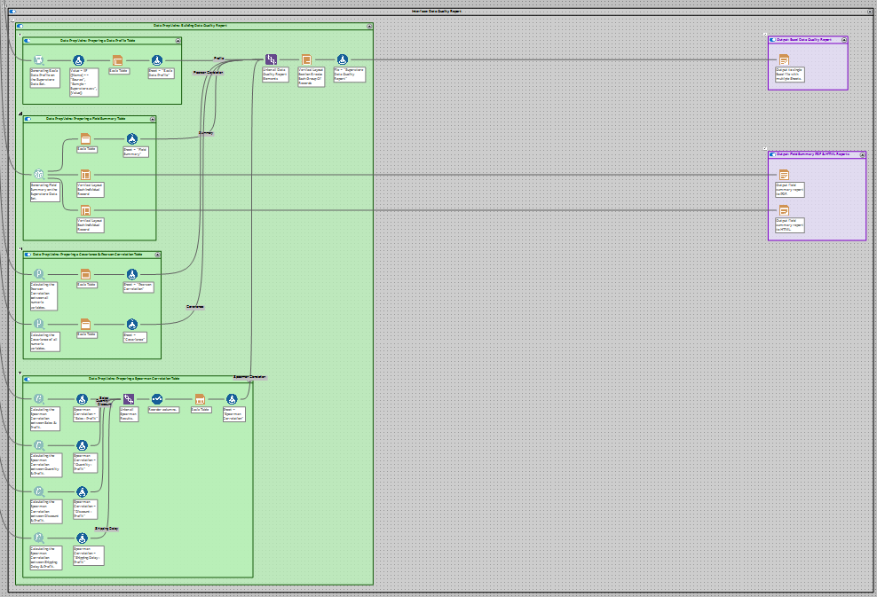**

### 🌍 Workflow graphical representation: Spatial Analysis.
- Using Alteryx Tools: 🗺️ Poly-Build Tool, 📍 Make Points Tool.
**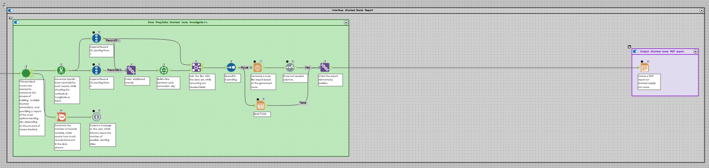**

## 🔁 Iterative Macro used in the "Superstore" project.
This [iterative macro](Shortest%20Route.yxmc) uses iterative process to find the nearest location using spatial analytics. This macro aims to solve the "Traveling Salesman Problem", but it needs an upstream macro that will run this process for other combination of starting points, which is further solved in "Shortest Route Batch" Macro.

### 🧠 Alteryx Custom Made Macro Group
- 🌀 Using Custom Made Iterative Macro
**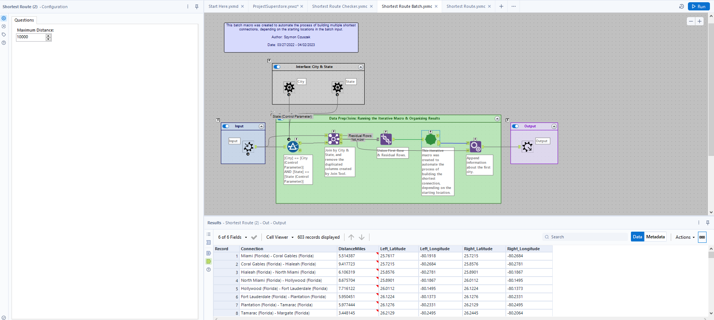**

### 🧩 Alteryx Custom Made Macro Group
- 🔍 Investigating Custom Made Iterative Macro
**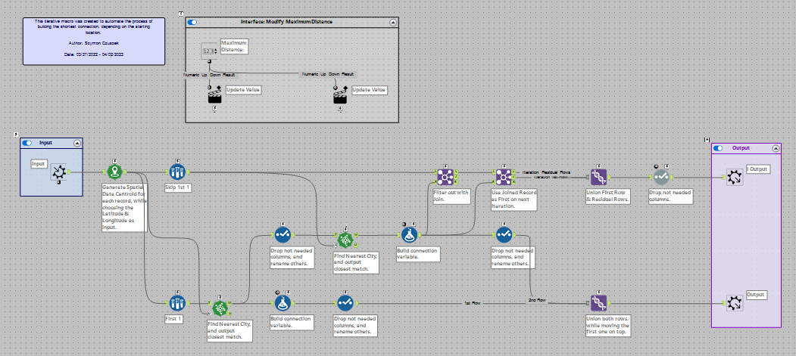**

## 📦 Batch Macro used in the "Superstore" Project.
This [batch macro](Shortest%20Route%20Batch.yxmc) uses batch process 🧮 to find the nearest location using spatial analytics. This macro aims to solve the "Traveling Salesman Problem" 🧭, and it is used to produce many outputs using batches. It needs an upstream macro, that will actually find the most optimal route, using MIN function, which is tackled further in the "Shortest Route Checker" Standard Macro.

### ⚡ Alteryx Custom Made Macro Group
- ⚙️ Using Custom Made Batch Macro
**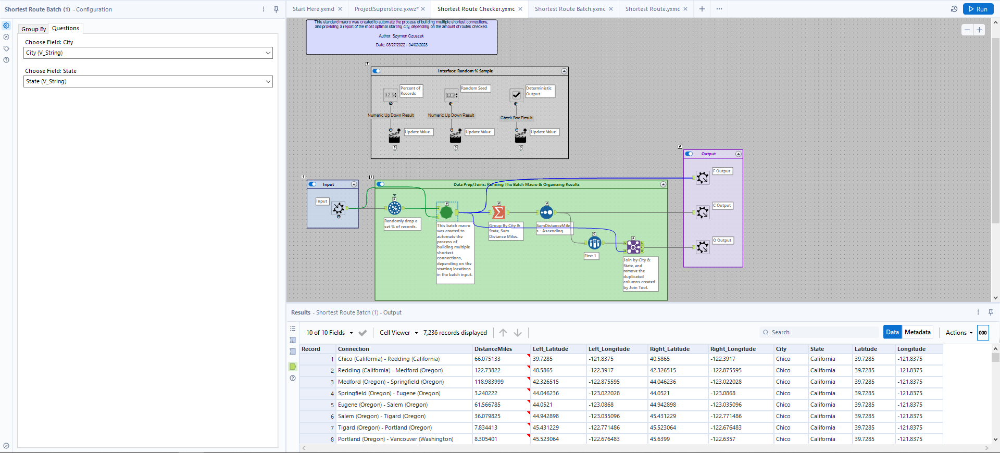**

### 🧠 Alteryx Custom Made Macro Group
- 🔍 Investigating Custom Made Batch Macro
**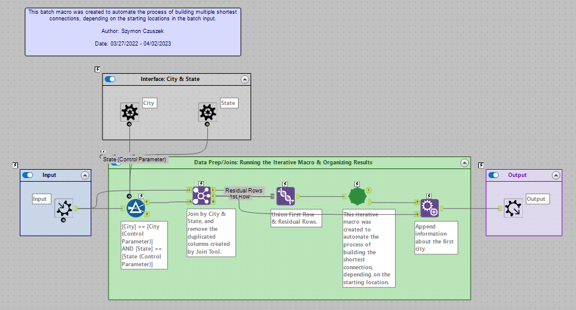**

## 🧠 Standard Macro used in "Superstore" project.
This [standard macro](Shortest%20Route%20Checker.yxmc) feeds iterative and batch process 🔁 to find the nearest location using spatial analytics 🗺️. This macro aims to solve the "Traveling Salesman Problem", but it's limitation is the longer run times ⏱️, depending on the amount of locations it needs to connect and check.

### 🧩 Standard Macro used in "Superstore" project. Alteryx Custom Made Macro Group
- 🔍 Using Custom Made Standard Macro
**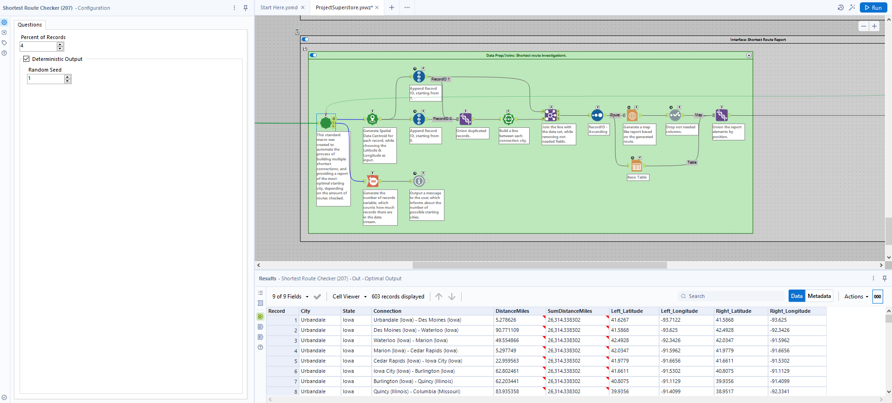**

### 🧠 Alteryx Custom Made Macro Group
- 🔍 Investigating Custom Made Standard Macro
**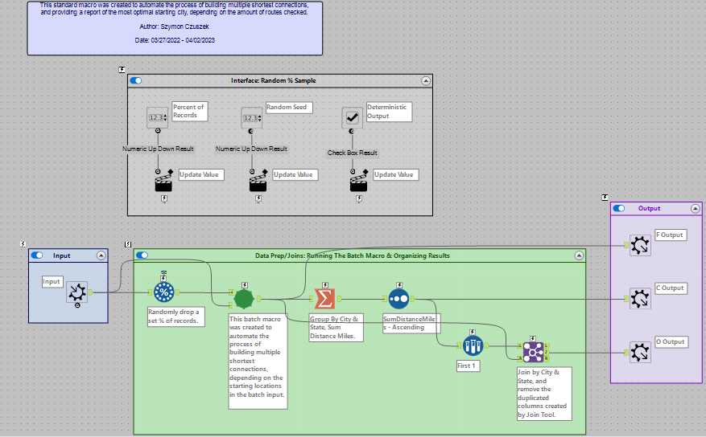**

## 🖥️ Project "Superstore" - Analytic Application only.
An [analytic app](ProjectSuperstore.yxwz) containing the user interface 🧰, spatial, reporting 🌍, macros 🧾, and other advanced functionalities ⚙️.

## 🗃️ Workflow-Screens Folder
- 📸 The folder contains screens of the workflow, as is in the file.

### [Tool Mastery](https://community.alteryx.com/t5/Tool-Mastery/Tool-Mastery-Action/ta-p/35500) | 🧩 Alteryx Interface Tool Group | ⚙️ Action Tool

#### ⚡ Alteryx Interface Tool Group
- 🖱️ Using Action Tool in Alteryx
**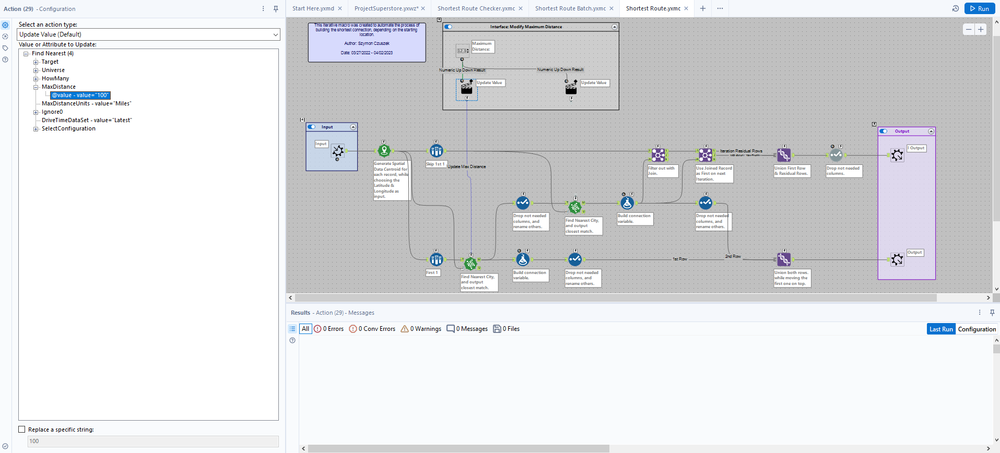**

### [Alteryx Help](https://help.alteryx.com/current/en/designer/tools/join/append-fields-tool.html) | 🔄 Alteryx Join Tool Group | 📎 Append Fields Tool

#### 🔄 Alteryx Join Tool Group
- 🧰 Using Append Fields Tool in Alteryx
**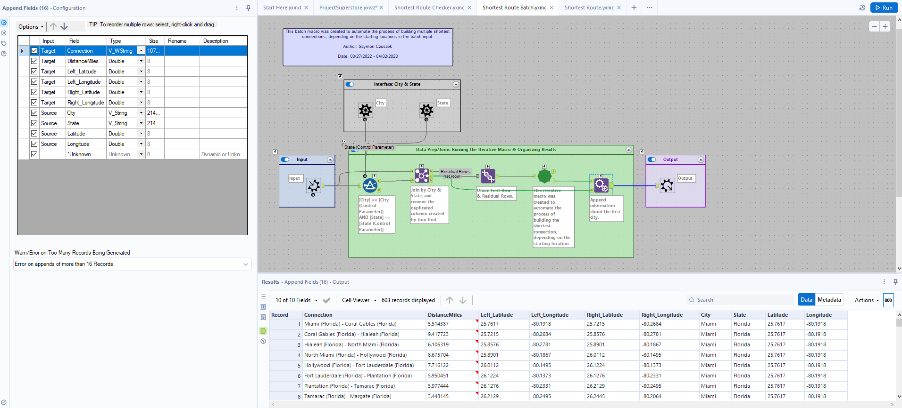**

### [Tool Mastery](https://community.alteryx.com/t5/Tool-Mastery/Tool-Mastery-Auto-Field/ta-p/49731?lightbox-message-images-49731=13686i8C7DFB7FE4CCD355) | 🛠️ Alteryx Preparation Tool Group | 🔠 Auto Field Tool

#### 🛠️ Using Auto Field Tool in Alteryx - Input
- 🔄 Screen-shot below presents the configuration of the auto filed tool. The metadata tab is selected on purpouse, as the tool will convert the string data types, as in the output anchor. The configuration of the tool comes down only to selection of the fileds, of which types we whish to adjust.
**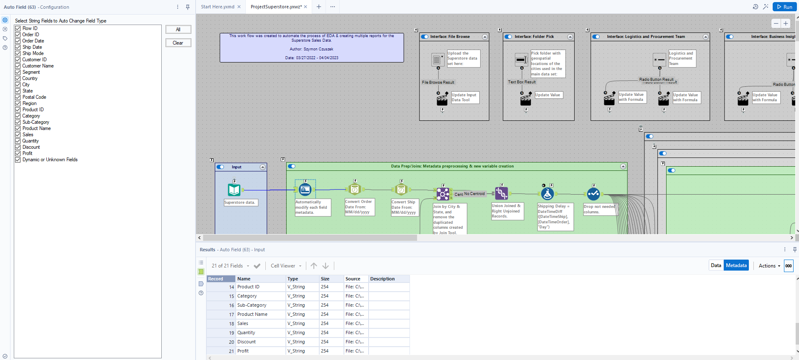** 

#### 📚 Using Auto Field Tool in Alteryx - Output
- 🧩 Screen-shot below presents the output anchor of the auto field tool, with already converted file types. As seen, some types like double or byte were easily recognizable by the tool, and got changed from string.
****

### [Tool Mastery](https://community.alteryx.com/t5/Tool-Mastery/Tool-Mastery-Basic-Data-Profile/ta-p/28610) | 🔍 Alteryx Data Investigation Tool Group | 🧰 Basic Data Profile Tool

#### 🕵️ Alteryx Data Investigation Group
- 📝 Using Basic Data Profile Tool in Alteryx
**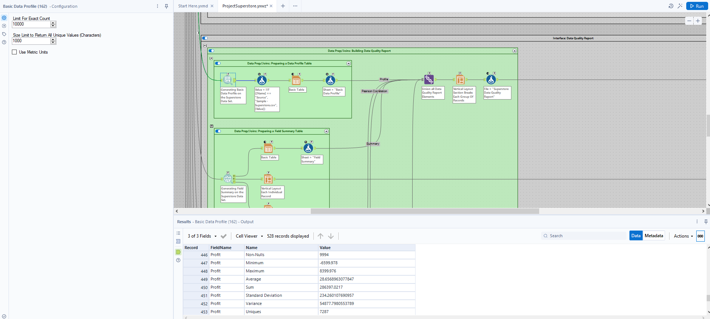**

### [Tool Mastery](https://community.alteryx.com/t5/Tool-Mastery/Tool-Mastery-Browse/ta-p/1208) | 🖥️ Alteryx In/Out Tool Group | 👁️ Browse Tool

#### 🖥️ Alteryx In/Out Group
- 🔍 Using Browse Tool in Alteryx
**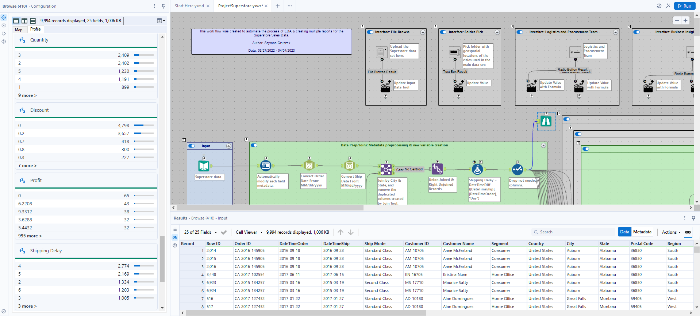**

### [Alteryx Help](https://help.alteryx.com/current/en/designer/tools/spatial/poly-build-tool.html#poly-build-tool) | 🌍 Alteryx Spatial Tool Group | 🗺️ Poly-Build Tool

#### 🌍 Alteryx Spatial Group
- 🗺️ Using Poly-Build Tool in Alteryx
**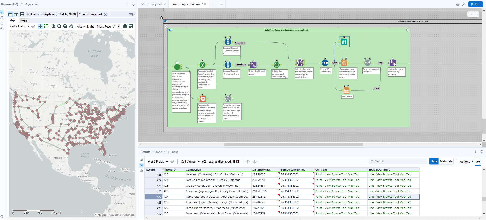**

### [Alteryx Help](https://help.alteryx.com/current/en/designer/tools/reporting/interactive-chart-tool.html) | 🖼️ Alteryx Reporting Tool Group | 📊 Interactive Chart Tool

#### 📝 Alteryx Reporting Group
- Using 📊 Interactive Chart Tool in Alteryx
**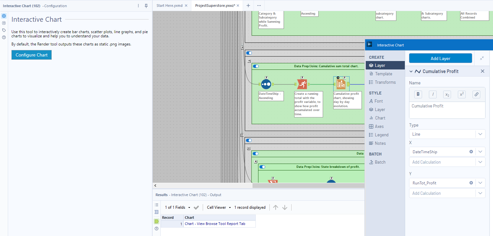**

### [Alteryx Help](https://help.alteryx.com/current/en/designer/tools/transform/count-records-tool.html##) | 🧮 Alteryx Interface Tool Group | 🎚️ Control Parameter Tool

#### 🧮 Alteryx Interface Group
- 🎚️ Using Control Parameter Tool in Alteryx
**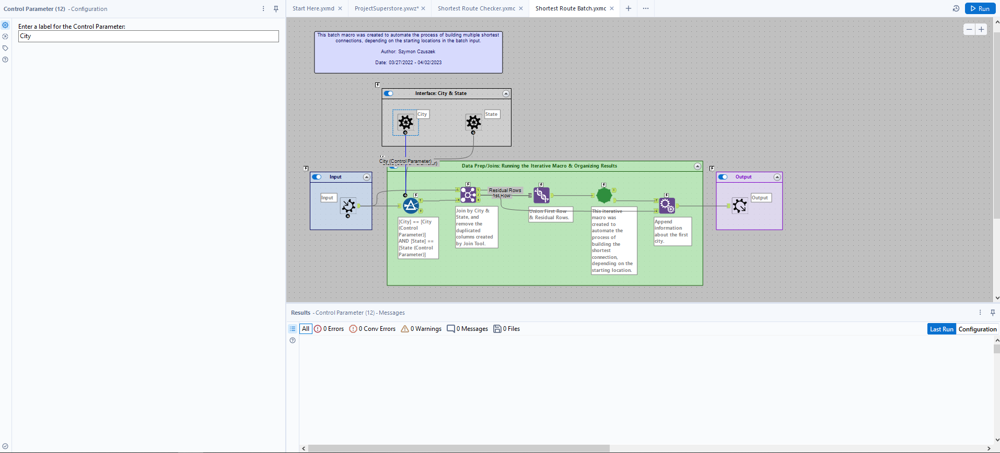**

### [Alteryx Help](https://help.alteryx.com/current/en/designer/tools/transform/count-records-tool.html##) | 📊 Alteryx Transform Tool Group | 🔢 Count Records Tool

#### 📊 Alteryx Transformation Group
- 🔢 Using Count Records Tool in Alteryx
**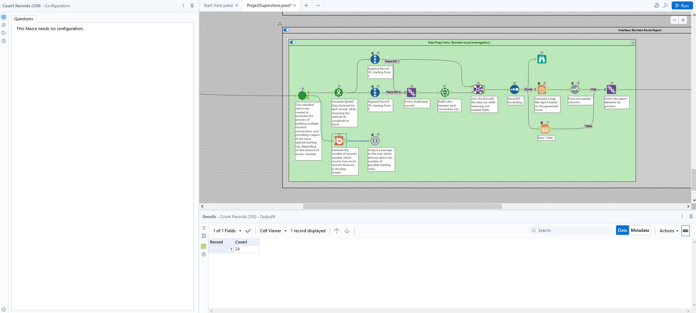**

### [Alteryx Help](https://help.alteryx.com/current/en/designer/tools/parse/datetime-tool.html) | 🔧 Alteryx Parse Tool Group | ⏱️ DateTime Tool

#### 🧰 Alteryx Parse Group
- 🕒 Using DateTime Tool in Alteryx
**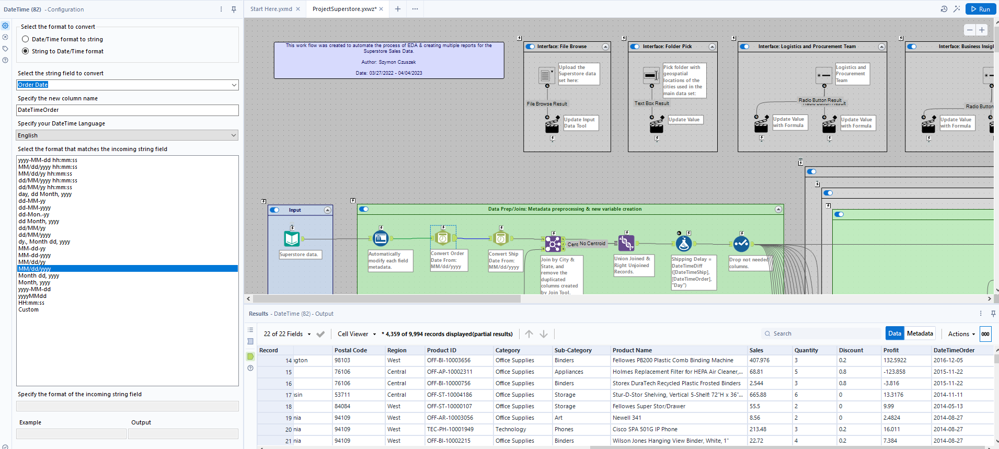**

### [Alteryx Help](https://help.alteryx.com/current/en/designer/tools/data-investigation/field-summary-tool.html) | 📈 Alteryx Data Investigation Tool Group | 📋 Field Summary Tool

#### 🔍 Alteryx Data Investigation Group
- 📋 Using Field Summary Tool in Alteryx
**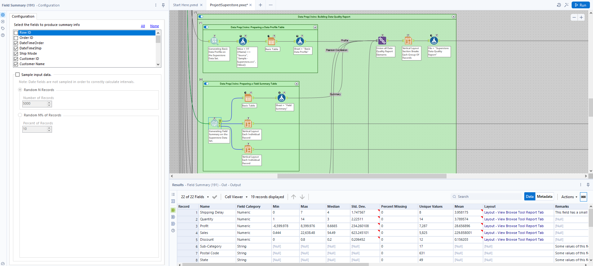**

### [Alteryx Help](https://help.alteryx.com/current/en/designer/tools/preparation/filter-tool.html) | 🧪 Alteryx Preparation Tool Group | 🚿 Filter Tool

#### 📦 Alteryx Preparation Group
- 🚿 Using Filter Tool in Alteryx
**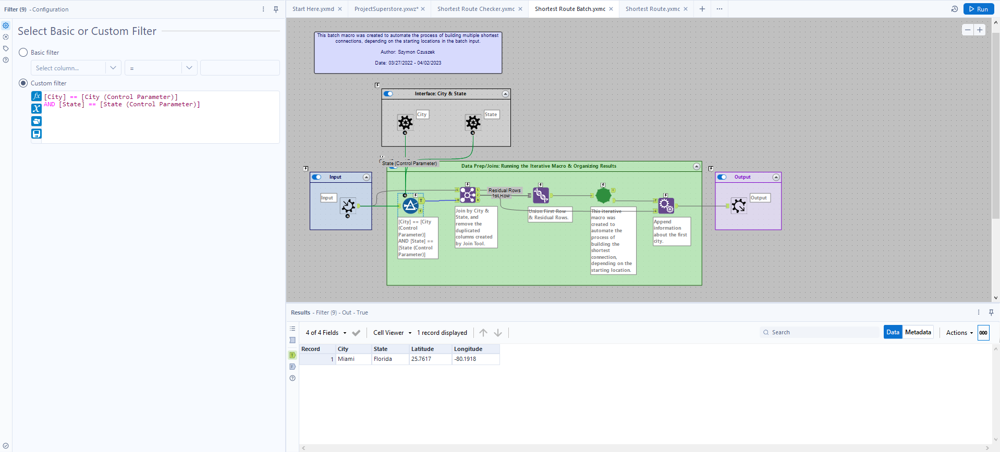**

### [Alteryx Help](https://help.alteryx.com/current/en/designer/tools/reporting/report-footer-tool.html) | 📝 Alteryx Reporting Tool Group | 🧾 Report Footer Tool

#### 📝 Alteryx Reporting Group
- 🧾 Using Report Footer Tool in Alteryx
**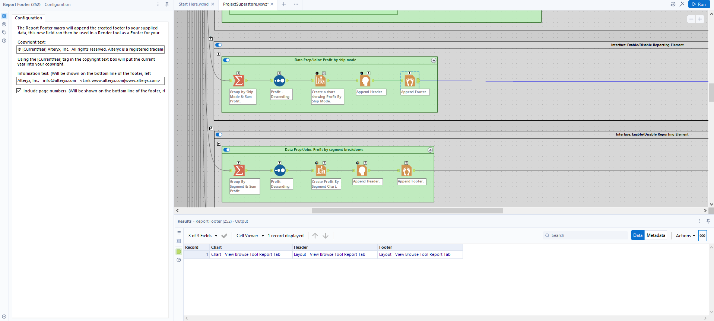**

### [Alteryx Help](https://help.alteryx.com/current/en/designer/tools/preparation/formula-tool.html) | 📦 Alteryx Preparation Tool Group | 🧮 Formula Tool

#### 📦 Alteryx Preparation Group
- 🧮 Using Formula Tool in Alteryx
**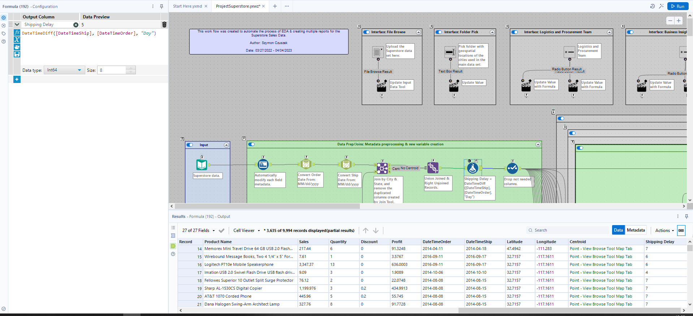**

### [Alteryx Help](https://help.alteryx.com/current/en/designer/tools/reporting/report-header-tool.html) | 📝 Alteryx Reporting Tool Group | 📄 Report Header Tool

#### 📝 Alteryx Reporting Group
- 📄 Using Report Header Tool in Alteryx
**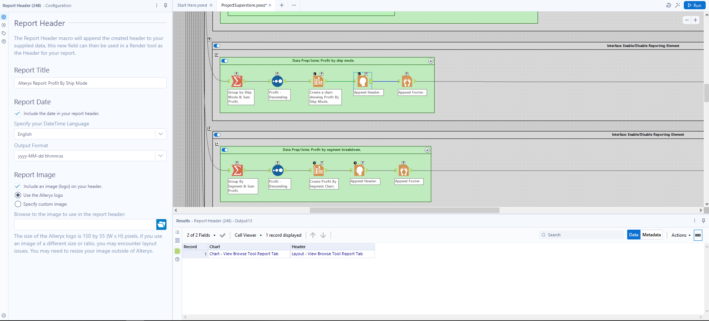**

### [Alteryx Help](https://help.alteryx.com/current/en/designer/tools/join/join-tool.html) | 🔄 Alteryx Join Tool Group | 🔗 Join Tool

#### 🔄 Alteryx Join Tool Group
- 🔗 Using Join Tool in Alteryx
**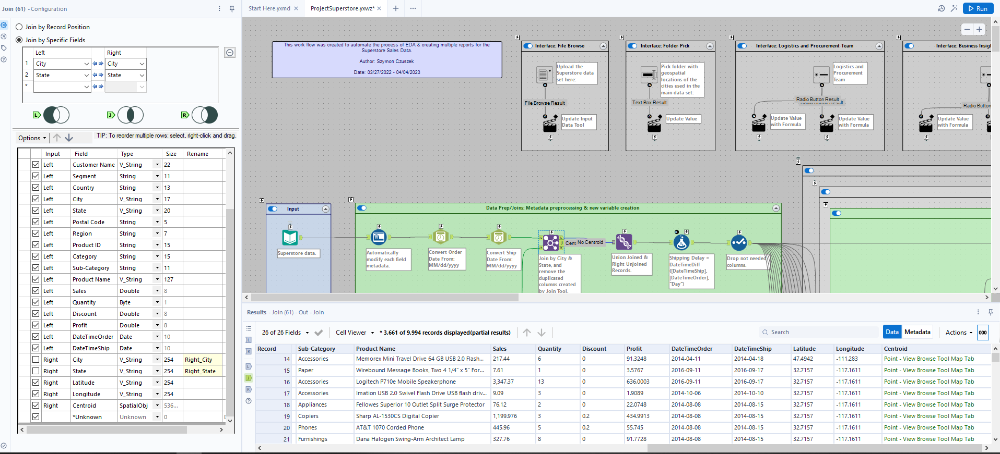**

### [Alteryx Help](https://help.alteryx.com/current/en/designer/tools/reporting/layout-tool.html) | 🖼️ Alteryx Reporting Tool Group | 🧾 Layout Tool

#### 📝 Alteryx Reporting Group
- 📰 Using Report Header Tool in Alteryx
**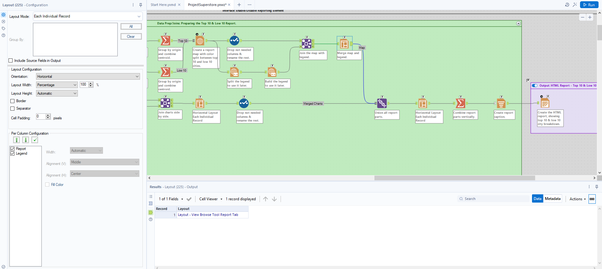**

### [Alteryx Help](https://help.alteryx.com/current/en/designer/tools/developer/message-tool.html) | 🧑‍💻 Alteryx Developer Tool Group | 📤 Message Tool

#### 🛠️ Alteryx Developer Tool Group
- 📤 Using Message Tool in Alteryx
**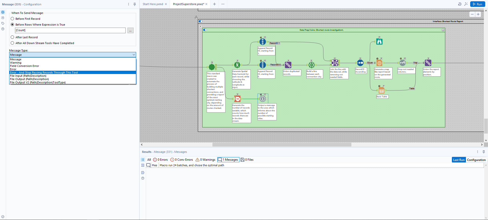**

### [Alteryx Help](https://help.alteryx.com/current/en/designer/tools/interface-tools/numeric-up-down-tool.html) | 🎛️ Alteryx Interface Tool Group | 🧩 Numeric Up Down Tool

#### 🧮 Alteryx Interface Tool Group
- 🧩 Using Numeric Up Down Tool in Alteryx
**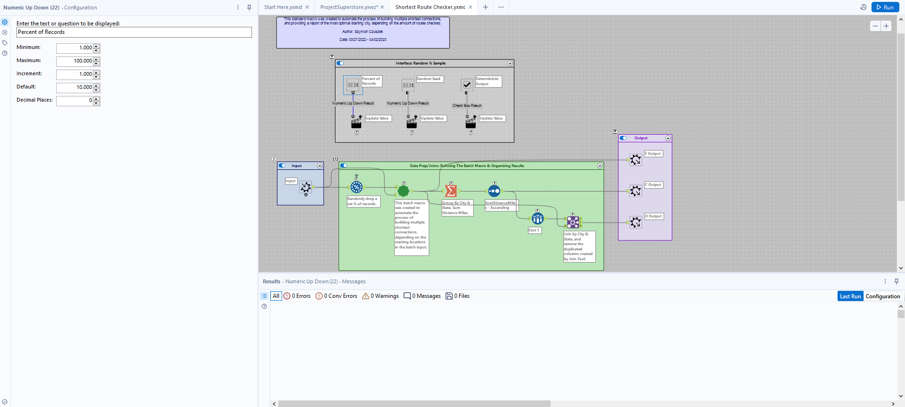**

### [Alteryx Help](https://help.alteryx.com/current/en/designer/tools/data-investigation/pearson-correlation-tool.html) | 🔬 Alteryx Data Investigation Tool Group | 🧪 Pearson Correlation Tool

#### Alteryx Data Investigation Group
- 🧪 Using Pearson Correlation Tool in Alteryx
**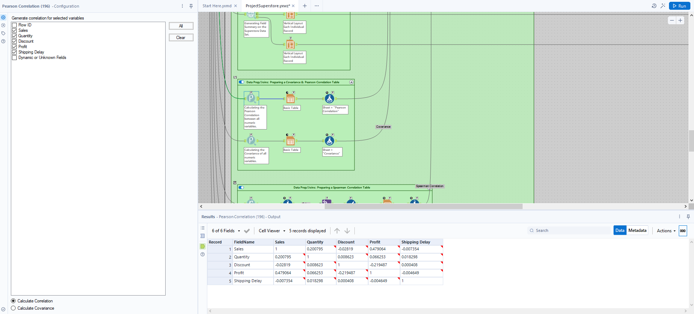**

### [Alteryx Help](https://help.alteryx.com/current/en/designer/tools/preparation/random---sample-tool.html) | 🧹 Alteryx Preparation Tool Group | 🧮 Random % Sample Tool

#### Alteryx Data Preparation Group
- 🧮 Using Random Sample Tool in Alteryx
**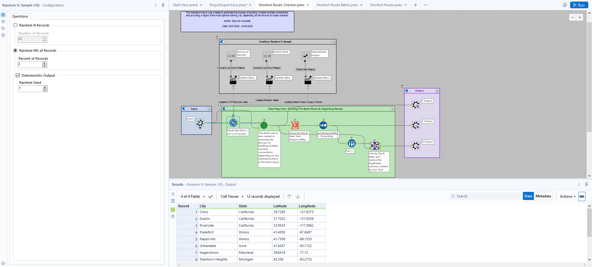**

### [Alteryx Help](https://help.alteryx.com/current/en/designer/tools/preparation/record-id-tool.html) | 🧹 Alteryx Preparation Tool Group | 🧰 Record ID Tool

#### Alteryx Data Preparation Group
- 🧰 Using Record ID Tool in Alteryx
****

### [Alteryx Help](https://help.alteryx.com/current/en/designer/tools/reporting/render-tool.html) | 🧾 Alteryx Reporting Tool Group | 🖼️ Render Tool

#### Alteryx Reporting Group
- 📰 Using Render Tool in Alteryx
**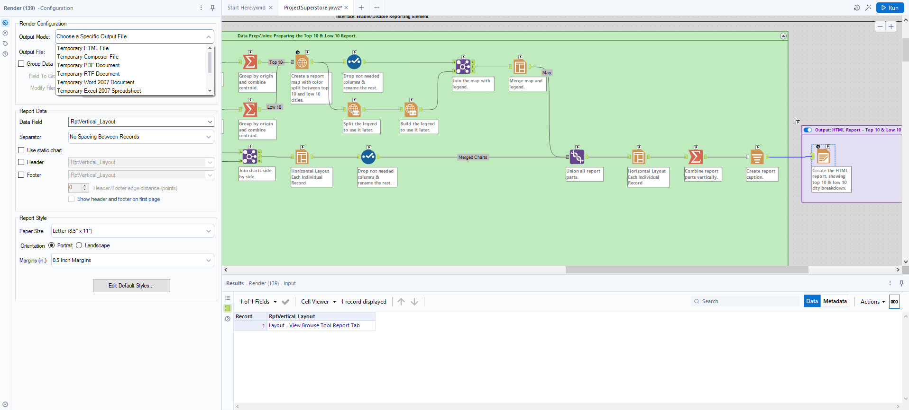**

### [Alteryx Help](https://help.alteryx.com/current/en/designer/tools/reporting/report-map-tool.html) | 🧾 Alteryx Reporting Tool Group | 🖼️ Report Map Tool

#### Alteryx Reporting Group
- 🖼️ Using Report Map Tool in Alteryx
**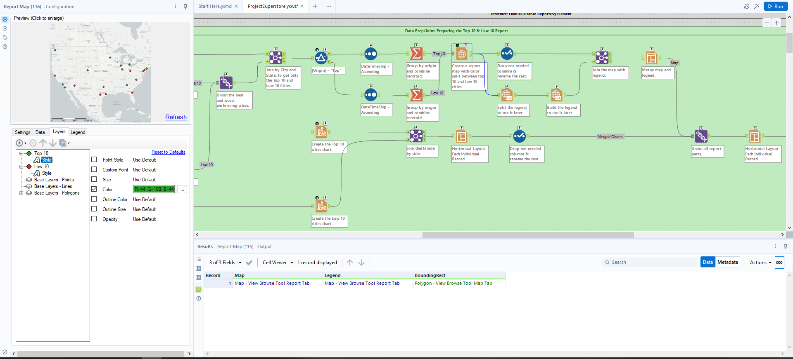**

### [Alteryx Help](https://help.alteryx.com/current/en/designer/tools/reporting/report-text-tool.html) | 🧾 Alteryx Reporting Tool Group | 🖼️ Report Text Tool

#### Alteryx Reporting Group
- 🧾 Using Report Text Tool in Alteryx
**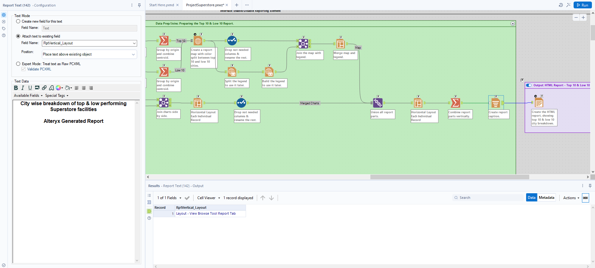**

### [Alteryx Help](https://help.alteryx.com/current/en/designer/tools/transform/running-total-tool.html) | 🧠 Alteryx Transform Tool Group | 🔁 Running Total Tool

#### Alteryx Transformation Group
- 🔁 Using Running Total Tool in Alteryx
**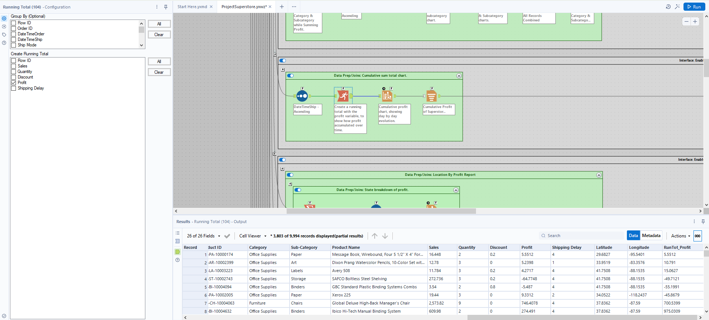**

### [Alteryx Help](https://help.alteryx.com/current/en/designer/tools/preparation/select-tool.html) | 🧹 Alteryx Preparation Tool Group | 🧰 Select Tool

#### Alteryx Data Preparation Group
- 🧰 Using Select Tool in Alteryx
**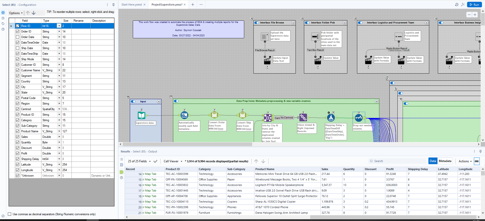**

### [Alteryx Help](https://help.alteryx.com/current/en/designer/tools/developer/dynamic-select-tool.html) | 🧑‍💻 Alteryx Developer Tool Group | 🧪 Dynamic Select Tool

#### Alteryx Developer Tool Group
- 🧪 Using Dynamic Select Tool in Alteryx
**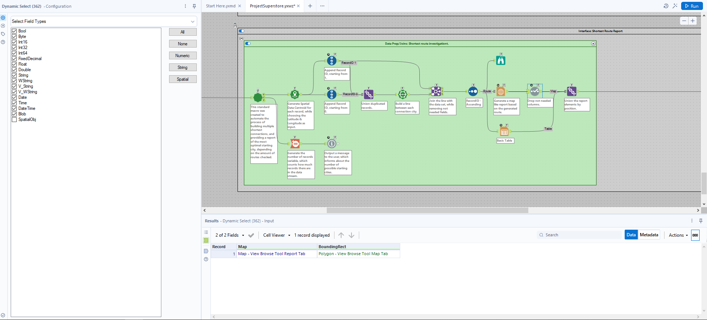**

### [Alteryx Help](https://help.alteryx.com/current/en/designer/tools/preparation/sort-tool.html) | 🧹 Alteryx Preparation Tool Group | 🔀 Sort Tool

#### Alteryx Data Preparation Group
- 🔁 Using Sort Tool in Alteryx
**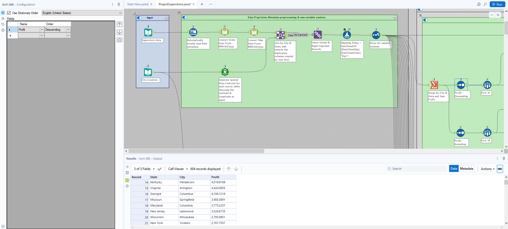**

### [Alteryx Help](https://help.alteryx.com/current/en/designer/tools/data-investigation/spearman-correlation-tool.html) | 🔬 Alteryx Data Investigation Tool Group | 🧪 Spearman Correlation Tool

#### Alteryx Data Investigation Group
- 🧪 Using Spearman Correlation Tool in Alteryx
**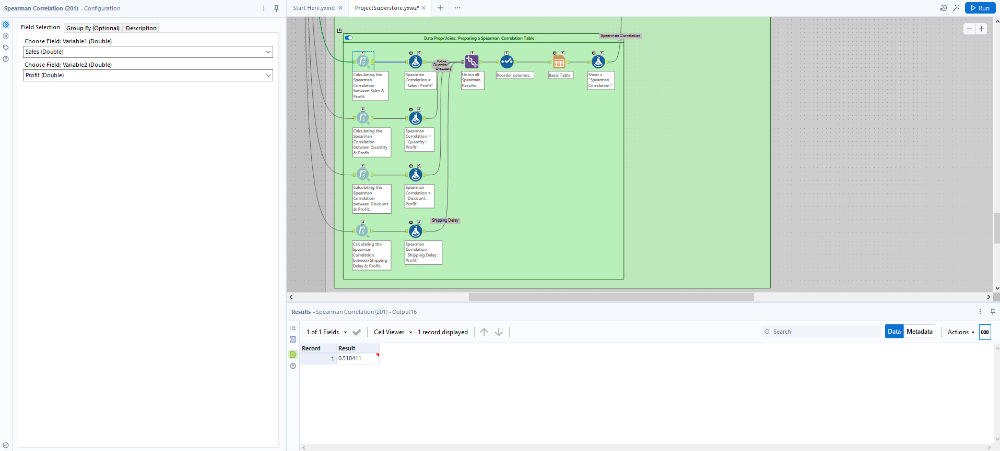**

### [Alteryx Help](https://help.alteryx.com/current/en/designer/tools/transform/summarize-tool.html) | 🔧 Alteryx Transform Tool Group | 🧠 Summarize Tool

#### Alteryx Transformation Group
- Using 🧠 Summarize Tool in Alteryx
**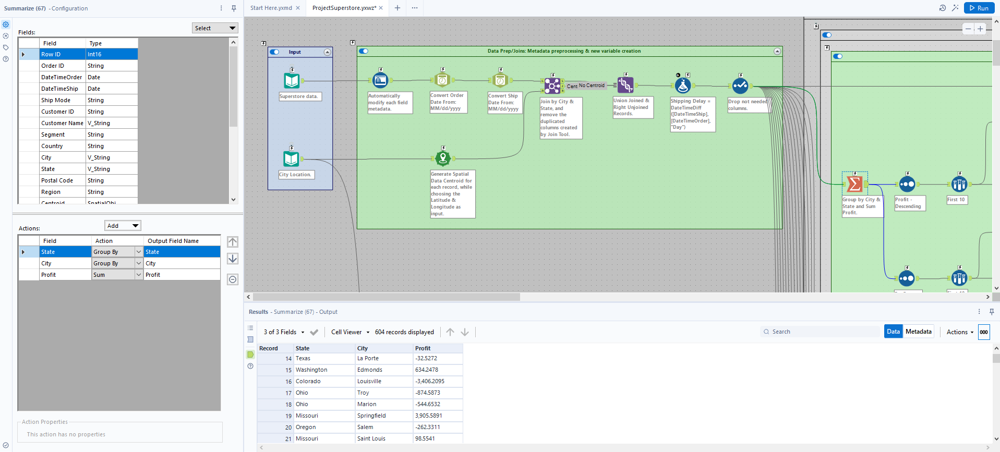**

### [Alteryx Help](https://help.alteryx.com/current/en/designer/tools/reporting/table-tool.html) | 🖼️ Alteryx Reporting Tool Group | 📰 Table Tool

#### Alteryx Reporting Group
- Using Table Tool in Alteryx
**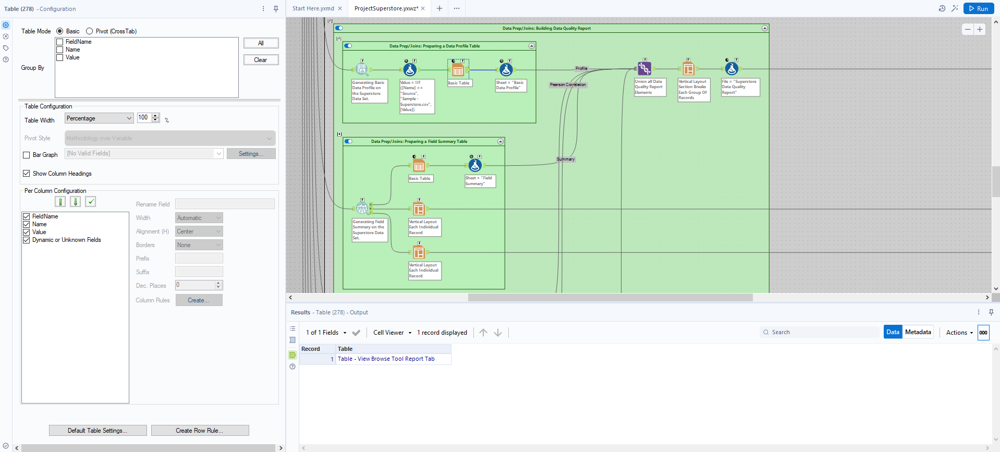**

### [Alteryx Help](https://help.alteryx.com/current/en/designer/tools/join/union-tool.html##) | 🔀 Alteryx Join Tool Group | 🤝 Union Tool

#### Alteryx Join Tool Group
- 🤝 Using Union Tool in Alteryx
**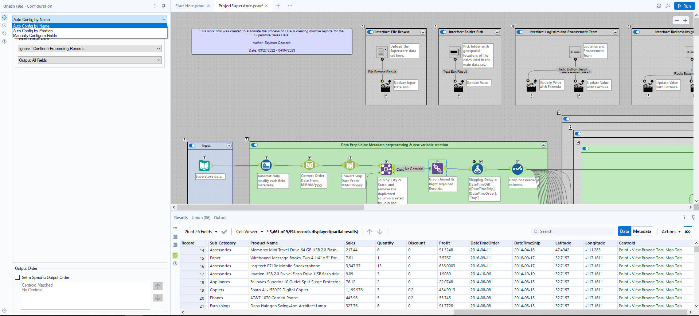**

## Disclaimer
🧑‍💻 The images used in this README are the property of Alteryx, Inc. and are used here for informational purposes only. All rights to these images are retained by Alteryx, Inc. No copyright infringement is intended.
